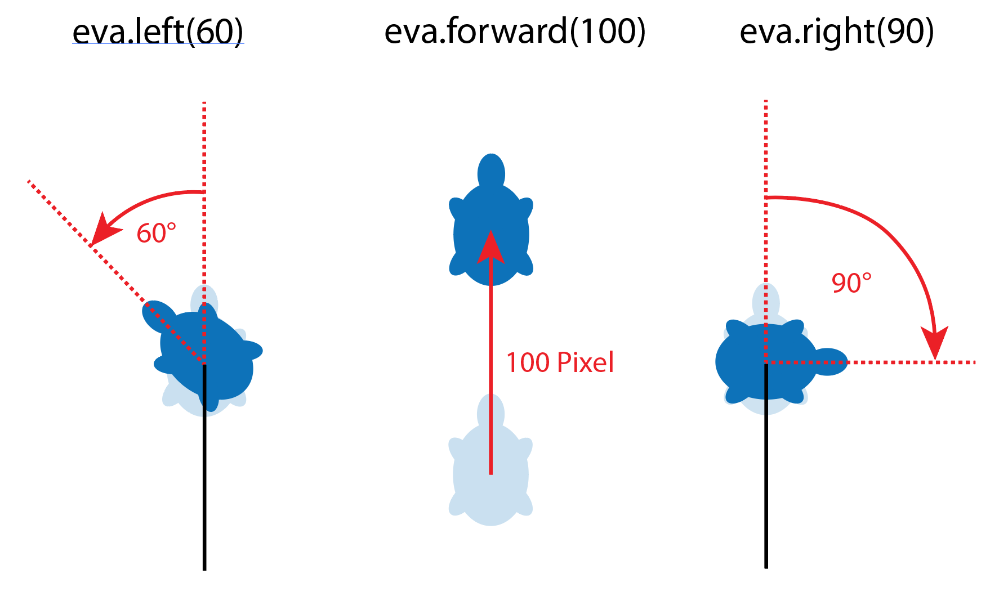

> [!success] Lernziele
> 
> - Sie können erklären, wie die Linie `import turtle{:python}` unser Programm erweitert.
## Unser Programm mit bestehenden Bibliotheken erweitern

Sie sind sicher einverstanden, dass wir nur wissen, was die Funktionen `input(...)` und `print(...)` machen - aber wir haben keine Ahnung, wie sie tatsächlich funktionieren. Jemand hat diese Funktionen für uns programmiert und wir gebrauchen sie einfach. Das ist im Programmieren ganz oft so, dass wir **auf bestehendem Code aufbauen**.

`input(...)` und `print(...)`  gehören zum Standard-Repertoire von Python. Aber man kann die Sprache noch viel weiter erweitern mit **Modulen, Paketen und Bibliotheken** aus aller Welt.

> [!note]- Zusatz: Modul, Paket und Bibliothek?
> 
> * Ein **Modul** ist eine Python-Datei, deren Funktionen *et cetera* man importieren kann.
> * Ein **Paket** ist ein ganzer Ordner voller Module, die ähnliche Dinge erledigen. Es kann auch Helferprogramme in anderen Programmiersprachen (Beispiel [Numpy](https://github.com/numpy/numpy)) enthalten.
> * Eine **Bibliothek** ist ein vager Sammelbegriff und wird hier synonym für grössere Pakete verwendet.

Für diesen Einstieg werden wir eine Bibliothek namens "turtle" verwenden. Mit diesem Paket können wir einfache Zeichnungen erstellen und so visuell programmieren lernen. Beginnen wir damit, die Turtle-Bibliothek zu importieren:

```python
import turtle
```

Durch den Import der Turtle-Bibliothek haben wir nun Zugriff auf alles, was darin enthalten ist. Damit können wir jetzt eine Schildkröte erstellen und ihr einen Namen geben. Wir nennen unsere Schildkröte "eva", weil das kurz und bündig ist:

```python
eva = turtle.Turtle()
```

Nun können wir eva sagen, was sie tun soll. Beispielsweise können wir ihr sagen, dass sie 80 Schritte vorwärts gehen, sich um 60° nach rechts drehen und dann wieder 60 Schritte vorwärts gehen soll:

```python
eva.forward(80)
eva.right(60)
eva.forward(60)
```

Alles zusammen sieht dann so aus. Sie können das Programm ausführen, indem Sie auf "▶️ Run" drücken.

```turtle
import turtle
eva = turtle.Turtle()

eva.forward(80)
eva.right(60)
eva.forward(60)

```

Mit diesen wenigen Zeilen Code können Sie Ihrer Schildkröte "eva" also bereits einfache Anweisungen geben und Zeichnungen erstellen. 

> [!exercise] Jetzt sind Sie dran!
> 
> Versuchen Sie mal folgende Figuren nachzumachen. (Grösse und Farbe müssen nicht stimmen.)

![[01-turtleintro-exercises.excalidraw]]

> [!info] Zusammenfassung
> 
> - Programme kann man mit Modulen, Paketen und Bibliotheken erweitern.
> - Wir importieren die Bibliothek `turtle` mit dem Befehl `import turtle`
> - `eva = turtle.Turtle()` erzeugt eine Turtle mit dem Namen `eva`.
> - Die Turtle befolgt die Anweisungen **Schritt für Schritt**.
> - Die Turtle dreht sich um den **Aussenwinkel**.
> 
