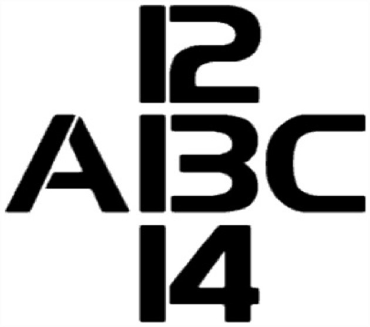
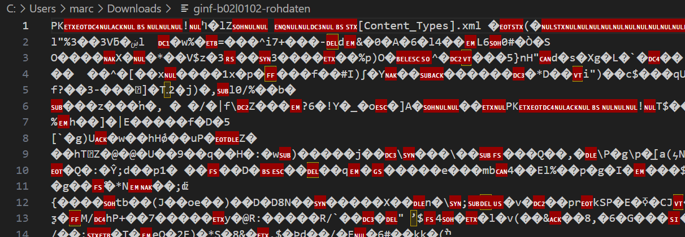

<TeachingNotes>
5 Begrüssung und Diskussion
15 Input Datentypen
10 Selbst durchlesen
10 Dateityp Game
5 Quiz selbst
</TeachingNotes>

> [!success]  Lernziele
> 
> - Sie können erklären, **wie aus Rohdaten Informationen entstehen**.
> - Sie kennen die Namen der **simplen Datentypen** und was für Informationen sie speichern.
> - Sie wissen, für was Dateiendungen beim Computer gut sind.
> - Sie können in einem Pythonprogramm einen **Semantikfehler** von einem **Syntaxfehler** unterscheiden.

Dieser Block dreht sich um die Frage: **Wie repräsentieren wir die Welt mit 0 und 1, damit wir die Rechenleistung von Computern nutzen können?**

Dazu folgendes Beispiel: Überlegen Sie sich, was Sie hier sehen.


Man muss wissen, wie man diese Rohdaten interpretieren soll - sonst kann man daraus keine Information ziehen.

> [!solution]- Lösung
> 
> Die **Rohdaten**, die Sie hier sehen, haben keine Bedeutung. Es ist einfach ein Rechteck oder eine gerade Linie, und eine gekrümmte Linie.
> 
> **Information** wird daraus erst, wenn Sie wissen, wie Sie die Daten interpretieren müssen. Ist es eine Zahl oder ein Buchstabe? Je nachdem ist die Bedeutung ganz anders!
> 
> 

## Simple Datentypen und Dateiformate

Schauen wir uns damit drei Grundbegriffe an:
- **Rohdaten** = Letztlich 0 und 1
- **Kodierung** = Interpretationsregeln - was bedeuten diese Nullen und Einsen in diesem Fall?
- **Information** = Für Menschen verständliche 

**Rohdaten ohne Kodierung sind bedeutungslose Nullen und Einsen**. 

![[01-rohdaten-semantik-info.excalidraw]]

### Simple Datentypen

In den allermeisten Programmiersprachen gibt es eine Reihe von simplen Datentypen. 
- Ganzzahlen heissen **Integer**.
- Fliesskommazahlen sind **Floats**.
- Zeichenketten sind **Strings**.
- Wahr oder unwahr sind **Bools**.

Alle diese Datentypen werden im Speicher anders mit Nullen und Einsen repräsentiert.

```turtle
ganzzahl = 14
print("Beispiel 1:", ganzzahl, "ist ein", type(ganzzahl))

kommazahl = 3.14
print("Beispiel 2:", kommazahl, "ist ein", type(kommazahl))

wort = "hallo"
print("Beispiel 3:", wort, "ist ein", type(wort))

wahrfalsch = False
print("Beispiel 4:", wahrfalsch, "ist ein", type(wahrfalsch))
```

Wieso gibt es zwei verschiedene Zahlentypen - Integer und Floats? Weil sie unterschiedlich gespeichert werden.
- **Integer** funktionieren so, wie wir das mit den Lämpchen beim Addierer auch getan haben. (Wobei negative Zahlen eine kleine Komplikation sind.)
- **Floats** speichert zwei Zahlen ähnlich der wissenschaftlichen Notation. 

> [!example]- Ein Beispiel, wie Pi gespeichert werden könnte
> 
> ```text
>     0 10000010 11001001000011111100111
>     ^     ^               ^
>     |     |               |
>     |     |               +--- significand = 0.7853975...
>     |     |
>     |     +------------------- exponent = 2 (130 - 128)
>     |
>     +------------------------- sign = 0 (positive)
> 
>     value= -1(sign) * 2(exponent) * (significand)
>     value= -10 * 22 * 0.7853975...
>     value= 3.14159...
> ```
### Datentypen in Python

Wieso musste Sie sich noch (fast) nie um Datentypen kümmern? Weil Python automatisch den Datentyp einer Variabel festlegt und dynamisch anpasst.

Das merken Sie z.B. bei einer Divison von zwei Ganzzahlen. Python kreiert bei Divisionen von zwei Ganzzahlen automatisch einen Float (Fliesskommazahl), auch wenn die Divison eigentlich restlos aufgehen würde - wie bei der Variable `ergebnis` in diesem Beispiel.

```turtle
ganzzahl1 = 14
print("1:", ganzzahl1, "ist ein", type(ganzzahl1))

ganzzahl2 = 2
print("2:", ganzzahl2, "ist ein", type(ganzzahl2))

ergebnis = ganzzahl1 / ganzzahl2
print("Ergebnis:", ergebnis, "ist ein", type(ergebnis))
```

### Dateiendungen

Wenn Sie Informationen abspeichern, müssen Sie also auch abspeichern, wie diese Daten interpretiert werden müssen. Sie kennen das vielleicht von **Dateiendungen** (oder "Dateierweiterungen", oder "Suffixe") auf Ihrem Computer.

Wieso weiss der Computer, dass eine Datei ein Word-Dokument ist? Weil die Datei mit ".docx" endet, also z.B. "abschlussarbeit.docx". Hätten die Datei keine Dateiendung, wären sie schön aufgeschmissen!


> [!info] Bei mir sehe ich keine Dateiendungen!
> 
> Wenn Sie keine Dateiendungen sehen, aber Ihr Computer die Dateien trotzdem richtig öffnet, heisst das, die Endungen sind da, aber Ihr Computer blendet sie aus (weil Sie ja am Icon ansehen, was für eine Datei es ist).
> 
> Hier lesen Sie, wie Sie auf [Windows](https://support.microsoft.com/de-de/windows/allgemeine-dateierweiterungen-in-windows-da4a4430-8e76-89c5-59f7-1cdbbc75cb01#:~:text=Geben%20Sie%20im%20Suchfeld%20auf,%2D%2FAusblenden%20das%20Kontrollk%C3%A4stchen%20Dateinamenerweiterungen.) und [OSX](https://support.apple.com/de-ch/guide/mac-help/mchlp2304/mac) die Dateiendungen anzeigen können.


Man spricht hier vom **Dateiformat**, das festlegt, wie die Daten in der Datei interpretiert werden müssen. Die Dateiendung signalisiert dem Computer das Dateiformat.

Versuchen wir das mal. [Laden Sie sich diese Datei mit einer unbekannten Dateiendung herunter](/data/rohdaten.ig).

Ihr Betriebssystem versucht Ihnen eventuell zu helfen und macht daraus eine "**.zip"-Datei, doch das stimmt nicht**!

Öffnen Sie diese im **Texteditor**. Sie werden so etwas sehen:



Versuchen Sie mal herauszufinden, wie Sie die Informationen in der Datei anzeigen können!

> [!solution]- Lösung
> 
> Es ist eine Word-Datei. Öffnen Sie sie direkt in Word oder fügen Sie die Dateiendung ".docx" am Ende des Dateinamens hinzu.

## Semantikfehler

Dass Datentypen in Python trotz automatischer Typisierung existieren und wichtig sind, zeigt folgendes Problem. Spielen Sie mit den Werten der Variabeln und versuchen Sie, eine gute Erklärung für die Ergebnisse zu finden!

```turtle
zahl1 = 14
zahl2 = 3
print("Die erste Summe ist", zahl1 + zahl2)

zahl1 = "14"
zahl2 = "3"
print("Die zweite Summe ist", zahl1 + zahl2)
```

- Im ersten Beispiel sind zahl1 und zahl2 als Ganzzahlen (Integers) definiert, weil sie ohne Anführungszeichen geschrieben sind. Ein **"+" zwischen zwei Ganzzahlen** bedeutet --> eine mathematische **Addition**.
- Im zweiten Beispiel sind zahl1 und zahl2 als Zeichenketten (Strings) definiert wegen der Anführungszeichen. Ein **"+" zwischen zwei Zeichenketten** bedeutet --> die **Zeichen aneinanderhängen**.

Das nennt man einen **Semantikfehler**, den Sie von einem **Syntaxfehler** unterscheiden können müssen.
### Syntax und Syntaxfehler

Die **Syntax** einer Programmiersprache beschreibt die **Regeln für die korrekte Schreibweise** von Code. 

Ein **Syntaxfehler** führen dazu, dass der Code nicht ausgeführt werden kann. 

Ein Beispiel:

```turtle
print("Hallo)  # Fehlendes schliessendes Anführungszeichen
```

👆 *Führen Sie den Code aus und beachten Sie die Fehlermeldung.*

- Das erste Anführungszeichen läutet eine Zeichenkette ein, aber das schliessende Anführungszeichen fehlt.
- Das Code wirft einen Fehler auf.

Syntaxfehler gibt es auch in der normalen Sprache, z.B.
```text
dieser satz, hat viele syntaxfeler!
```

### **Semantik** und Semantikfehler

Die **Semantik** beschreibt die **Bedeutung** eines korrekt geschriebenen Programms oder Ausdrucks. Sie legt fest, **was der Code tut** und wie er interpretiert wird.

**Semantikfehler** lassen das Programm laufen, aber es tut nicht das, was eigentlich beabsichtigt war.

Ein zusätzliches Beispiel:

```turtle
eingabe = input("Geben Sie eine Zahl ein:")
ergebnis = 3 * eingabe
print("Das Produkt ist", ergebnis)
```

- Der Code läuft **ohne Syntaxfehler**.
- `input()` erzeugt **immer** einen String, auch wenn die User Zahlen eingeben.
- `*` bedeutet bei Strings: **Wiederholung**, nicht Multiplikation!
- Beispiel: Wenn die User `5` eingiben, gibt der Code `555` aus, nicht `15`.

Semantikfehler gibt es auch in der normalen Sprache. Oft verwendet wird dieser Satz:
```text
Farblose grüne Ideen schlafen zornig.
```
## Kontrollfragen

<IsNotAuthenticated>

Sie können sich oben mit <FeatherIcon size={'1rem'} icon="log-in" className="inline" /> anmelden, dann werden Ihre Antworten auf dem Server gespeichert.

</IsNotAuthenticated>

import { Question } from 'shared/components/Quiz'

### Frage 1: Datentypen in Python

Welche der folgenden Aussagen zu Datentypen in Python sind korrekt?
<Question id="datentypen-2Aspw4rg">
    <Option is="true" feedback="Python erkennt den Datentyp automatisch.">
        Python erkennt den Datentyp einer Variablen automatisch.
    </Option>

    <Option feedback="Python benötigt keine Typendeklaration.">
        In Python müssen Variablentypen explizit angegeben werden.
    </Option>

    <Option is="true" feedback="Python kann den Typ einer Variablen während der Laufzeit ändern.">
        Eine Variable kann in Python ihren Datentyp dynamisch ändern, während das Programm ausgeführt wird.
    </Option>
</Question>
### Frage 2: Semantikfehler

Warum ist folgender Code ein Semantikfehler?  

```python
eingabe = input("Geben Sie eine Zahl ein:")
ergebnis = 3 * eingabe
print("Das Produkt ist", ergebnis)
````

<Question id="semantik-w4rg">
	<Option is="true" feedback="input() gibt einen String zurück, und * bedeutet folglich String-Wiederholung statt Multiplikation.">
	    Weil `input()` einen String liefert und `*` dann die Zeichenkette wiederholt.
	</Option>
	
	<Option feedback="Nicht ganz – die Eingabe ist nicht das Problem, sondern die Art, wie sie interpretiert wird.">
	    Weil die User eine falsche Zahl eingeben könnten.
	</Option>
</Question>
### Frage 3: Dateiformate und Endungen

Warum sind Dateiendungen wichtig?

<Question id="dateiformat-9asdrg">
	<Option feedback="Die Dateiendung sagt nichts über den Speicherort aus.">
	    Sie zeigen an, wo die Datei auf der Festplatte gespeichert ist.
	</Option>
	
	<Option is="true" feedback="Ohne Dateiendungen müssten Computer jede Datei öffnen und versuchen herauszufinden, was all die Nullen und Einsen bedeuten könnten.">
	    Sie signalisieren, wie (z.B. mit welchem Programm) die Rohdaten interpretiert werden können.
	</Option>
	
	<Option feedback="Dateiendungen werden vom Betriebssystem jedes Mal verwendet, wenn Sie eine Datei öffnen.">
	    Sie werden beim Programmieren verwendet.
	</Option>
</Question>

