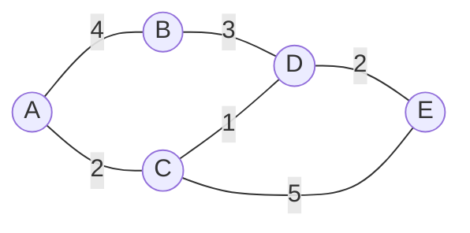

> [!success] Lernziele
>
> - Sie verstehen, wie Router den besten Weg für Pakete durch ein Netzwerk finden.
> - Sie können den Dijkstra-Algorithmus anhand eines einfachen Netzwerks von Hand durchführen.
> - Sie verstehen, warum Routing-Protokolle für das Internet unverzichtbar sind.

In der letzten Lektion haben wir gesehen, dass Router Pakete an andere Router weiterleiten, wenn sie das Zielnetzwerk nicht kennen. Aber wie findet ein Paket den **besten Weg** durch ein Netzwerk mit vielen Routern? Das ist die Aufgabe von **Routing-Algorithmen**.

## Das Internet als Graph

Das Internet besteht aus tausenden von Routern, die miteinander verbunden sind. Man kann dieses Netzwerk als **Graphen** darstellen:
- **Knoten** sind die Router
- **Kanten** sind die Verbindungen zwischen Routern
- **Kantengewichte** sind die "Kosten" einer Verbindung (z.B. Latenz in Millisekunden)

<StickMe>
![[net-05-routing-network.excalidraw]]
</StickMe>

In diesem Beispiel sind A bis E alles Router. Die Zahlen auf den Kanten geben die "Kosten" an - je tiefer, desto besser. Das könnte die Latenz in Millisekunden sein oder eine andere Metrik.

**Frage:** Was ist der kürzeste Weg von A nach E?

> [!solution]- Lösung
>
> Es gibt mehrere Wege von A nach E:
> - A → B → D → E: Kosten 4 + 3 + 2 = **9**
> - A → C → D → E: Kosten 2 + 1 + 2 = **5**
> - A → C → E: Kosten 2 + 5 = **7**
>
> Der kürzeste Weg ist **A → C → D → E** mit Kosten 5.

## Der Dijkstra-Algorithmus

Edsger Dijkstra entwickelte 1956 einen Algorithmus, der systematisch den kürzesten Weg von einem Startknoten zu allen anderen Knoten findet. Der Algorithmus ist elegant und wird heute noch in Navigationssystemen und Routing-Protokollen verwendet.

### So funktioniert Dijkstra

Der Algorithmus verwendet eine **Prioritätswarteschlange** (Priority Queue), in der Knoten nach ihrer bisherigen Gesamtdistanz vom Startknoten sortiert sind. Der Knoten mit der kleinsten Distanz wird immer zuerst bearbeitet.

1. **Initialisierung:** Setze die Distanz zum Startknoten auf 0, alle anderen auf ∞ (unendlich). Füge den Startknoten in die Prioritätswarteschlange ein.
2. **Entnimm** den Knoten mit der kleinsten Distanz aus der Warteschlange.
3. **Prüfe alle Nachbarn:** Für jeden Nachbarn berechne die neue Gesamtdistanz (aktuelle Distanz + Kantengewicht). Ist diese kleiner als die bisherige Distanz, aktualisiere sie und füge den Nachbarn in die Warteschlange ein.
4. **Markiere** den aktuellen Knoten als besucht.
5. **Wiederhole** ab Schritt 2, bis das Ziel besucht wurde. (Man kann auch alle kürzesten Verbindungen suchen, dann macht man einfach weiter, bis die Schlange leer ist.)

### Beispiel: Kürzester Weg von A nach E

Wir führen den Algorithmus Schritt für Schritt durch:

Die Farben zeigen den Zustand: grün = besucht, blau = in Queue, orange = aktuell

**Schritt 0 - Initialisierung:**

<table className="dijkstra-table">
<thead><tr><th>Knoten</th><th>Distanz</th><th>Vorgänger</th></tr></thead>
<tbody>
<tr style={{background: 'rgba(59, 130, 246, 0.15)'}}><td>A</td><td>0</td><td>-</td></tr>
<tr><td>B</td><td>∞</td><td>-</td></tr>
<tr><td>C</td><td>∞</td><td>-</td></tr>
<tr><td>D</td><td>∞</td><td>-</td></tr>
<tr><td>E</td><td>∞</td><td>-</td></tr>
</tbody>
</table>

**Schritt 1 - Besuche A (kleinste Distanz in Queue: 0):**

Nachbarn von A: B (Kosten 4), C (Kosten 2)
- Distanz zu B: min(∞, 0+4) = 4
- Distanz zu C: min(∞, 0+2) = 2

<table className="dijkstra-table">
<thead><tr><th>Knoten</th><th>Distanz</th><th>Vorgänger</th></tr></thead>
<tbody>
<tr style={{background: 'rgba(245, 158, 11, 0.25)'}}><td>A</td><td>0</td><td>-</td></tr>
<tr style={{background: 'rgba(59, 130, 246, 0.15)'}}><td>C</td><td>2</td><td>A</td></tr>
<tr style={{background: 'rgba(59, 130, 246, 0.15)'}}><td>B</td><td>4</td><td>A</td></tr>
<tr><td>D</td><td>∞</td><td>-</td></tr>
<tr><td>E</td><td>∞</td><td>-</td></tr>
</tbody>
</table>

**Schritt 2 - Besuche C (kleinste Distanz in Queue: 2):**

Nachbarn von C: D (Kosten 1), E (Kosten 5)
- Distanz zu D: min(∞, 2+1) = 3
- Distanz zu E: min(∞, 2+5) = 7

<table className="dijkstra-table">
<thead><tr><th>Knoten</th><th>Distanz</th><th>Vorgänger</th></tr></thead>
<tbody>
<tr style={{background: 'rgba(16, 185, 129, 0.15)'}}><td>A</td><td>0</td><td>-</td></tr>
<tr style={{background: 'rgba(245, 158, 11, 0.25)'}}><td>C</td><td>2</td><td>A</td></tr>
<tr style={{background: 'rgba(59, 130, 246, 0.15)'}}><td>D</td><td>3</td><td>C</td></tr>
<tr style={{background: 'rgba(59, 130, 246, 0.15)'}}><td>B</td><td>4</td><td>A</td></tr>
<tr style={{background: 'rgba(59, 130, 246, 0.15)'}}><td>E</td><td>7</td><td>C</td></tr>
</tbody>
</table>

**Schritt 3 - Besuche D (kleinste Distanz in Queue: 3):**

Nachbarn von D: B (Kosten 3), E (Kosten 2)
- Distanz zu B: min(4, 3+3) = 4 (keine Verbesserung)
- Distanz zu E: min(7, 3+2) = 5 (Verbesserung!)

<table className="dijkstra-table">
<thead><tr><th>Knoten</th><th>Distanz</th><th>Vorgänger</th></tr></thead>
<tbody>
<tr style={{background: 'rgba(16, 185, 129, 0.15)'}}><td>A</td><td>0</td><td>-</td></tr>
<tr style={{background: 'rgba(16, 185, 129, 0.15)'}}><td>C</td><td>2</td><td>A</td></tr>
<tr style={{background: 'rgba(245, 158, 11, 0.25)'}}><td>D</td><td>3</td><td>C</td></tr>
<tr style={{background: 'rgba(59, 130, 246, 0.15)'}}><td>B</td><td>4</td><td>A</td></tr>
<tr style={{background: 'rgba(59, 130, 246, 0.15)'}}><td>E</td><td>5</td><td>D</td></tr>
</tbody>
</table>

**Schritt 4 - Besuche B (kleinste Distanz in Queue: 4):**

Nachbar von B: D (bereits besucht)
- Keine Aktualisierungen nötig.

<table className="dijkstra-table">
<thead><tr><th>Knoten</th><th>Distanz</th><th>Vorgänger</th></tr></thead>
<tbody>
<tr style={{background: 'rgba(16, 185, 129, 0.15)'}}><td>A</td><td>0</td><td>-</td></tr>
<tr style={{background: 'rgba(16, 185, 129, 0.15)'}}><td>C</td><td>2</td><td>A</td></tr>
<tr style={{background: 'rgba(16, 185, 129, 0.15)'}}><td>D</td><td>3</td><td>C</td></tr>
<tr style={{background: 'rgba(245, 158, 11, 0.25)'}}><td>B</td><td>4</td><td>A</td></tr>
<tr style={{background: 'rgba(59, 130, 246, 0.15)'}}><td>E</td><td>5</td><td>D</td></tr>
</tbody>
</table>

**Schritt 5 - Besuche E (kleinste Distanz in Queue: 5):**

<table className="dijkstra-table">
<thead><tr><th>Knoten</th><th>Distanz</th><th>Vorgänger</th></tr></thead>
<tbody>
<tr style={{background: 'rgba(16, 185, 129, 0.15)'}}><td>A</td><td>0</td><td>-</td></tr>
<tr style={{background: 'rgba(16, 185, 129, 0.15)'}}><td>C</td><td>2</td><td>A</td></tr>
<tr style={{background: 'rgba(16, 185, 129, 0.15)'}}><td>D</td><td>3</td><td>C</td></tr>
<tr style={{background: 'rgba(16, 185, 129, 0.15)'}}><td>B</td><td>4</td><td>A</td></tr>
<tr style={{background: 'rgba(245, 158, 11, 0.25)'}}><td>E</td><td>5</td><td>D</td></tr>
</tbody>
</table>

Ziel erreicht - fertig!

**Ergebnis:** Der kürzeste Weg von A nach E hat Kosten **5**. Den Weg rekonstruieren wir über die Vorgänger: E ← D ← C ← A, also **A → C → D → E**.

## Routing im Internet

Im echten Internet verwenden Router Protokolle wie **OSPF** (Open Shortest Path First), die auf Dijkstra basieren. Die Router tauschen dabei kontinuierlich Informationen über ihre Nachbarn und die Verbindungskosten aus. So kann jeder Router eine "Karte" des Netzwerks aufbauen und den besten Weg berechnen.

Die "Kosten" einer Verbindung können verschiedene Faktoren berücksichtigen:
- **Latenz** (Verzögerung in Millisekunden)
- **Bandbreite** (je mehr Kapazität, desto besser)
- **Auslastung** (überlastete Verbindungen vermeiden)
- **Zuverlässigkeit** (stabile Verbindungen bevorzugen)

## Übungsaufgaben

### Aufgabe 1: Dijkstra von Hand

Kreieren Sie sich im [interaktiven Dijkstra-Visualizer](net-06-dijkstra-visualizer) ein Internet mit 6 bis 9 Routern. Lösen Sie auf 

### Aufgabe 2: Alternative Wege

Im folgenden Netzwerk fällt die Verbindung zwischen C und E aus.
![[net-05-routing-outage.excalidraw]]

a) Was war der kürzeste Weg von A nach F, bevor die Verbindung ausfiel?

b) Was ist der kürzeste Weg jetzt?

> [!solution]- Lösung
>
> a) **Vor dem Ausfall:** A → C → E → F war $1 + 2 + 1 = 4$. 
> 
> b) Jetzt müssen die Router andere Wege suchen:
> - A → B → D → F: $2 + 5 + 4 = 11$
> - A → B → D → E → F: $2 + 5 + 2 + 1 = 10$
>
> Der kürzeste Weg ist **A → B → D → E → F** mit Kosten 10.

> [!warning] CIDR-Schreibweise
> Die Schreibweise `/24` ist eine Kurzform für die Subnetmaske `255.255.255.0`. Die Zahl gibt an, wie viele Bytes zum Netzwerkteil gehören (mal 8):
> - `/24` = 3 Bytes = `255.255.255.0`
> - `/16` = 2 Bytes = `255.255.0.0`
> - `/8` = 1 Byte = `255.0.0.0`

### Aufgabe 3: Routing-Tabelle

Ein Router R ist direkt mit drei Netzwerken verbunden und hat folgende Routing-Tabelle:

| Zielnetzwerk | Nächster Hop | Kosten |
|--------------|--------------|--------|
| `10.0.1.0/24` | direkt | 0 |
| `10.0.2.0/24` | direkt | 0 |
| `10.0.3.0/24` | direkt | 0 |
| `192.168.1.0/24` | `10.0.1.5` | 3 |
| `192.168.2.0/24` | `10.0.2.10` | 5 |
| `0.0.0.0/0` (Standard) | `10.0.3.1` | - |

Wohin leitet Router R Pakete mit folgenden Ziel-IPs weiter?

a) `10.0.1.100`
b) `192.168.1.50`
c) `8.8.8.8`

> [!solution]- Lösung
>
> a) `10.0.1.100` → Liegt im Netzwerk `10.0.1.0/24` → **direkt zugestellt** (keine Weiterleitung nötig)
>
> b) `192.168.1.50` → Liegt im Netzwerk `192.168.1.0/24` → Weiterleitung an **`10.0.1.5`**
>
> c) `8.8.8.8` → Liegt in keinem bekannten Netzwerk → **Standardroute** an `10.0.3.1`
