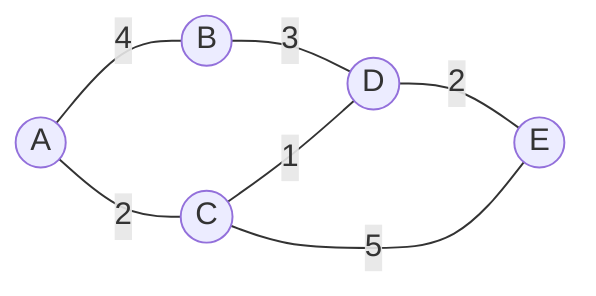
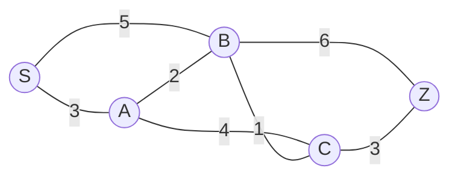
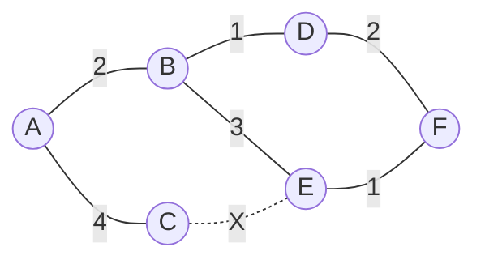

> [!success] Lernziele
>
> - Sie verstehen, wie Router den besten Weg für Pakete durch ein Netzwerk finden.
> - Sie können den Dijkstra-Algorithmus anhand eines einfachen Netzwerks von Hand durchführen.
> - Sie verstehen, warum Routing-Protokolle für das Internet unverzichtbar sind.

In der letzten Lektion haben wir gesehen, dass Router Pakete an andere Router weiterleiten, wenn sie das Zielnetzwerk nicht kennen. Aber wie findet ein Paket den **besten Weg** durch ein Netzwerk mit vielen Routern? Das ist die Aufgabe von **Routing-Algorithmen**.

## Das Internet als Graph

Das Internet besteht aus tausenden von Routern, die miteinander verbunden sind. Man kann dieses Netzwerk als **Graphen** darstellen:
- **Knoten** sind die Router
- **Kanten** sind die Verbindungen zwischen Routern
- **Kantengewichte** sind die "Kosten" einer Verbindung (z.B. Latenz in Millisekunden)

<StickMe>

</StickMe>

In diesem Beispiel sind A bis E Router. Die Zahlen auf den Kanten geben die "Kosten" an – je tiefer, desto besser. Das könnte die Latenz in Millisekunden sein oder eine andere Metrik.

**Frage:** Was ist der kürzeste Weg von A nach E?

> [!solution]- Lösung
>
> Es gibt mehrere Wege von A nach E:
> - A → B → D → E: Kosten 4 + 3 + 2 = **9**
> - A → C → D → E: Kosten 2 + 1 + 2 = **5**
> - A → C → E: Kosten 2 + 5 = **7**
>
> Der kürzeste Weg ist **A → C → D → E** mit Kosten 5.

## Der Dijkstra-Algorithmus

Edsger Dijkstra entwickelte 1956 einen Algorithmus, der systematisch den kürzesten Weg von einem Startknoten zu allen anderen Knoten findet. Der Algorithmus ist elegant und wird heute noch in Navigationssystemen und Routing-Protokollen verwendet.

### So funktioniert Dijkstra

1. **Initialisierung:** Setze die Distanz zum Startknoten auf 0, alle anderen auf ∞ (unendlich).
2. **Wähle** den unbesuchten Knoten mit der kleinsten Distanz.
3. **Aktualisiere** die Distanzen aller Nachbarn: Wenn der Weg über den aktuellen Knoten kürzer ist, übernimm die neue Distanz.
4. **Markiere** den aktuellen Knoten als besucht.
5. **Wiederhole** ab Schritt 2, bis alle Knoten besucht sind.

### Beispiel: Kürzester Weg von A nach E

Wir führen den Algorithmus Schritt für Schritt durch:

**Schritt 0 – Initialisierung:**

| Knoten | Distanz | Vorgänger | Besucht |
|--------|---------|-----------|---------|
| A | 0 | – | ❌ |
| B | ∞ | – | ❌ |
| C | ∞ | – | ❌ |
| D | ∞ | – | ❌ |
| E | ∞ | – | ❌ |

**Schritt 1 – Besuche A (kleinste Distanz: 0):**

Nachbarn von A: B (Kosten 4), C (Kosten 2)
- Distanz zu B: min(∞, 0+4) = 4
- Distanz zu C: min(∞, 0+2) = 2

| Knoten | Distanz | Vorgänger | Besucht |
|--------|---------|-----------|---------|
| A | 0 | – | ✅ |
| B | 4 | A | ❌ |
| C | 2 | A | ❌ |
| D | ∞ | – | ❌ |
| E | ∞ | – | ❌ |

**Schritt 2 – Besuche C (kleinste unbesuchte Distanz: 2):**

Nachbarn von C: D (Kosten 1), E (Kosten 5)
- Distanz zu D: min(∞, 2+1) = 3
- Distanz zu E: min(∞, 2+5) = 7

| Knoten | Distanz | Vorgänger | Besucht |
|--------|---------|-----------|---------|
| A | 0 | – | ✅ |
| B | 4 | A | ❌ |
| C | 2 | A | ✅ |
| D | 3 | C | ❌ |
| E | 7 | C | ❌ |

**Schritt 3 – Besuche D (kleinste unbesuchte Distanz: 3):**

Nachbarn von D: B (Kosten 3), E (Kosten 2)
- Distanz zu B: min(4, 3+3) = 4 (keine Verbesserung)
- Distanz zu E: min(7, 3+2) = 5 (Verbesserung!)

| Knoten | Distanz | Vorgänger | Besucht |
|--------|---------|-----------|---------|
| A | 0 | – | ✅ |
| B | 4 | A | ❌ |
| C | 2 | A | ✅ |
| D | 3 | C | ✅ |
| E | 5 | D | ❌ |

**Schritt 4 – Besuche B (kleinste unbesuchte Distanz: 4):**

Nachbar von B: D (bereits besucht)
- Keine Aktualisierungen nötig.

| Knoten | Distanz | Vorgänger | Besucht |
|--------|---------|-----------|---------|
| A | 0 | – | ✅ |
| B | 4 | A | ✅ |
| C | 2 | A | ✅ |
| D | 3 | C | ✅ |
| E | 5 | D | ❌ |

**Schritt 5 – Besuche E (kleinste unbesuchte Distanz: 5):**

Alle Knoten besucht – fertig!

**Ergebnis:** Der kürzeste Weg von A nach E hat Kosten **5**. Den Weg rekonstruieren wir über die Vorgänger: E ← D ← C ← A, also **A → C → D → E**.

## Routing im Internet

Im echten Internet verwenden Router Protokolle wie **OSPF** (Open Shortest Path First), die auf Dijkstra basieren. Die Router tauschen dabei kontinuierlich Informationen über ihre Nachbarn und die Verbindungskosten aus. So kann jeder Router eine "Karte" des Netzwerks aufbauen und den besten Weg berechnen.

Die "Kosten" einer Verbindung können verschiedene Faktoren berücksichtigen:
- **Latenz** (Verzögerung in Millisekunden)
- **Bandbreite** (je mehr Kapazität, desto besser)
- **Auslastung** (überlastete Verbindungen vermeiden)
- **Zuverlässigkeit** (stabile Verbindungen bevorzugen)

## Übungsaufgaben

### Aufgabe 1: Dijkstra von Hand

Führen Sie den Dijkstra-Algorithmus für folgendes Netzwerk durch. Startknoten ist **S**, Ziel ist **Z**.

a) Füllen Sie die Tabelle aus.
b) Was ist der kürzeste Weg von S nach Z und welche Kosten hat er?

> [!solution]- Lösung
>
> **Schritt-für-Schritt:**
>
> | Schritt | Besuche | S | A | B | C | Z |
> |---------|---------|---|---|---|---|---|
> | 0 | – | 0 | ∞ | ∞ | ∞ | ∞ |
> | 1 | S | 0 | 3 (S) | 5 (S) | ∞ | ∞ |
> | 2 | A | 0 | 3 | 5 (S) | 7 (A) | ∞ |
> | 3 | B | 0 | 3 | 5 | 6 (B) | 11 (B) |
> | 4 | C | 0 | 3 | 5 | 6 | 9 (C) |
> | 5 | Z | 0 | 3 | 5 | 6 | 9 |
>
> b) Der kürzeste Weg ist **S → A → B → C → Z** mit Kosten **9**.
>
> Hinweis: S → B → C → Z wäre auch 5 + 1 + 3 = 9, also gleich gut!

### Aufgabe 2: Alternative Wege

Im folgenden Netzwerk fällt die Verbindung zwischen C und E aus.

a) Was war der kürzeste Weg von A nach F, bevor die Verbindung ausfiel?
b) Was ist der kürzeste Weg jetzt?

> [!solution]- Lösung
>
> a) **Vor dem Ausfall:** A → C → E → F wäre 4 + ? + 1... aber wir kennen die Kosten von C-E nicht aus der Aufgabe. Schauen wir die anderen Wege:
> - A → B → D → F: 2 + 1 + 2 = **5**
> - A → B → E → F: 2 + 3 + 1 = **6**
>
> Der kürzeste Weg war **A → B → D → F** mit Kosten 5.
>
> b) **Nach dem Ausfall:** Die Verbindung C-E ist irrelevant für den kürzesten Weg, da er sowieso über B ging. Der kürzeste Weg bleibt **A → B → D → F** mit Kosten **5**.

### Aufgabe 3: Routing-Tabelle

Ein Router R ist direkt mit drei Netzwerken verbunden und hat folgende Routing-Tabelle:

| Zielnetzwerk | Nächster Hop | Kosten |
|--------------|--------------|--------|
| `10.0.1.0/24` | direkt | 0 |
| `10.0.2.0/24` | direkt | 0 |
| `10.0.3.0/24` | direkt | 0 |
| `192.168.1.0/24` | `10.0.1.5` | 3 |
| `192.168.2.0/24` | `10.0.2.10` | 5 |
| `0.0.0.0/0` (Standard) | `10.0.3.1` | – |

Wohin leitet Router R Pakete mit folgenden Ziel-IPs weiter?

a) `10.0.1.100`
b) `192.168.1.50`
c) `8.8.8.8`

> [!solution]- Lösung
>
> a) `10.0.1.100` → Liegt im Netzwerk `10.0.1.0/24` → **direkt zugestellt** (keine Weiterleitung nötig)
>
> b) `192.168.1.50` → Liegt im Netzwerk `192.168.1.0/24` → Weiterleitung an **`10.0.1.5`**
>
> c) `8.8.8.8` → Liegt in keinem bekannten Netzwerk → **Standardroute** an `10.0.3.1`
